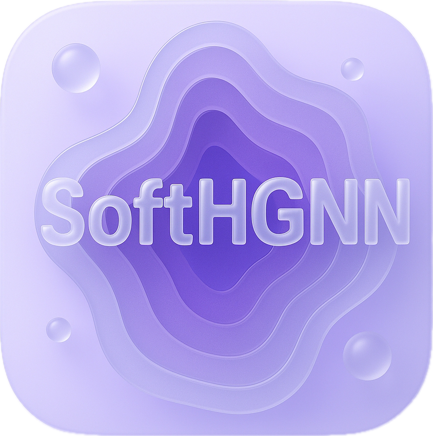
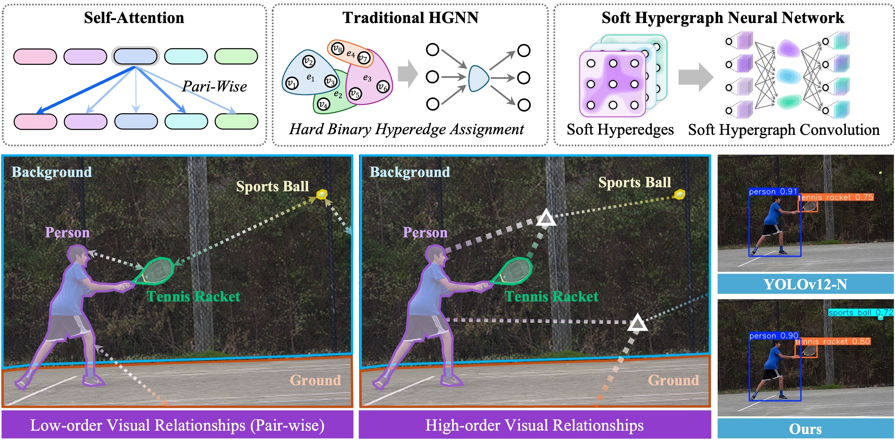
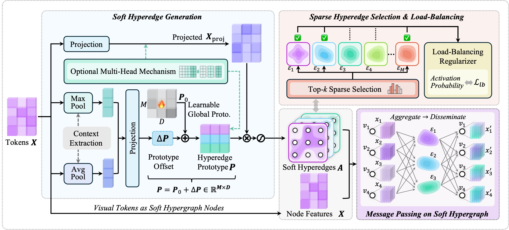
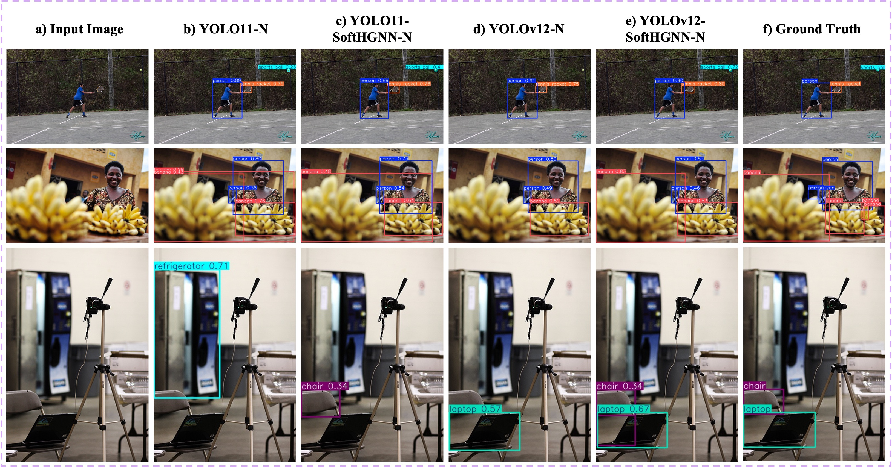
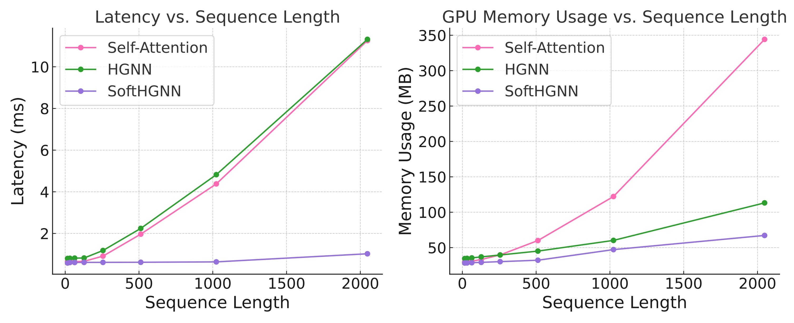

<p align="center">
    
<p>
<h2 align="center">SoftHGNN: Soft Hypergraph Neural Networks for General Visual Recognition</h2>


<div align="center">
    
</div>

<h4>Table of Contents</h4>

- [Overview🔍](#overview)
- [Tasks and Datasets📚](#tasks-and-datasets)
  - [1. Image Classification](#1-image-classification)
  - [2. Crowd Counting](#2-crowd-counting)
  - [3. Object Detection](#3-object-detection)
- [Experimental Results🏆](#experimental-results)
  - [1. Image Classification](#1-image-classification-1)
  - [2. Crowd Counting](#2-crowd-counting-1)
  - [3. Object Detection](#3-object-detection-1)
  - [4. Computational Efficiency](#4-computational-efficiency)
- [Getting Started🚀](#getting-started)
  - [Image Classification](#image-classification)
    - [1. Environment Setup](#1-environment-setup)
    - [2. Data Preparation](#2-data-preparation)
    - [3. Training and Testing](#3-training-and-testing)
  - [CrowdCouting](#crowdcouting)
    - [1. Environment Setup](#1-environment-setup-1)
    - [2. Data Preparation](#2-data-preparation-1)
    - [3.Training](#3training)
  - [ObjectDetection](#objectdetection)
    - [The train.py script](#the-trainpy-script)
- [Open-Source Training Records and Weights🎞️](#open-source-training-records-and-weights️)
- [Related Projects🔗](#related-projects)
- [Cite our work📝](#cite-our-work)


## Overview🔍
<div align="center">
    
</div>
**Figure 1. The proposed Soft Hypergraph Neural Network framework. It consists of three major steps: 1) Soft hyperedge generation. 2) Message passing on the soft hypergraph. 3) Sparse hyperedge selection and load-balancing (optional).**

**_Abstract -_** Visual recognition relies on understanding both the semantic content of image tokens and the complex interactions among them. Mainstream self-attention methods, while effective at modeling global pair-wise relations, fail to capture high-order associations inherent in real-world scenes and often suffer from redundant computation. Hypergraphs extend conventional graphs by modeling high-order interactions and offer a promising framework for addressing these limitations. However, existing hypergraph neural networks typically rely on static and hard  hyperedge assignments, leading to excessive and redundant hyperedges with hard binary node memberships that overlook the continuity of visual semantics. To overcome these bottlenecks, we present Soft Hypergraph Neural Networks (SoftHGNNs), which extend the theory of hypergraph computation, to make it truly efficient and versatile in visual recognition tasks. Our framework introduces the concept of soft hyperedges, where each node is associated with hyperedges via continuous participation weights rather than hard binary assignments. This dynamic and differentiable association is achieved by using learnable hyperedge prototype vectors. Through similarity measurements between token features and these prototypes, the model generates semantically rich soft hyperedges. By using these soft hyperedges as the medium for message aggregation and dissemination, the SoftHGNN models various high-order semantic relationships within visual features. To further enhance efficiency when scaling up the number of soft hyperedges, we incorporate a sparse hyperedge selection mechanism that activates only the top-$k$ important soft hyperedges, along with a load balancing regularizer to ensure adequate and balanced hyperedge utilization. Experimental results across three tasks on five datasets demonstrate that SoftHGNN accurately and efficiently captures high-order semantic relationships in visual scenes, achieving significant performance improvements. 


## Tasks and Datasets📚

To validate the superiority and universality of the proposed SoftHGNN, we conducted extensive experiments on three typical visual recognition tasks: **image classification, crowd counting, and object detection**. In these tasks, we employed a total of five widely-used datasets. In the following, we briefly introduce these datasets by task.


### 1. Image Classification
For the image classification task, we adopted the CIFAR-10 and CIFAR-100 datasets, which are widely used in both academia and industry to evaluate model performance on color image classification. Click here for more information: [🔗CIFAR](https://www.cs.toronto.edu/~kriz/cifar.html)
- **CIFAR-10**: The CIFAR-10 dataset, developed by researchers at the Canadian Institute for Advanced Research, consists of 60,000 32×32 color images divided into 10 classes. Each class contains 6,000 images, with 5,000 images for training and 1,000 images for testing. The classes include airplanes, automobiles, birds, cats, deer, dogs, frogs, horses, ships, and trucks.
- **CIFAR-100**: CIFAR-100 is an extension of CIFAR-10, containing 60,000 32×32 color images divided into 100 classes. Each class comprises 600 images, with 500 images for training and 100 images for testing. Additionally, the 100 classes are grouped into 20 superclasses, which provide a more challenging classification task.

### 2. Crowd Counting
The crowd counting task focuses on accurately estimating the number of targets in dense scenes. We utilized the ShanghaiTech Part-A and Part-B datasets. In each image, every target (person) is annotated with a point near the center of the head, resulting in over 330,000 annotations in total. Click here for downloading the dataset: [🔗ShanghaiTech](https://github.com/desenzhou/ShanghaiTechDataset)
- **ShanghaiTech Part-A**: This dataset contains 482 images, primarily featuring dense crowd scenes, with 300 images in the training set and 182 images in the test set.
- **ShanghaiTech Part-B**: This dataset comprises 716 images with relatively sparser crowd scenes, where 400 images are used for training and 316 images for testing.

### 3. Object Detection
The object detection task requires the model to not only recognize the categories of objects in images but also to accurately localize them. For this purpose, we conducted experiments on the MSCOCO dataset. You can download the dataset from the official website: [🔗MSCOCO](https://cocodataset.org/#download)
- **MSCOCO**: The Microsoft Common Objects in Context (MSCOCO) dataset is a large-scale benchmark for object detection, segmentation, keypoint detection, and image captioning, containing over 328,000 images. The dataset provides bounding boxes and instance segmentation masks for 80 object categories, along with extensive keypoint annotations, making it an essential benchmark in the field of object detection.


## Experimental Results🏆

### 1. Image Classification

**Table 1. Classification accuracy on CIFAR-10 and CIFAR-100 datasets.**
| Method                    | CIFAR-10 ACC (%)                           | CIFAR-100 ACC (%)                          |
|---------------------------|--------------------------------------------|--------------------------------------------|
| ViT                       | 78.6                                       | 53.4                                       |
| + Self-Attention          | 78.8 <span style="color:green">(↑0.2)</span> | 53.8 <span style="color:green">(↑0.4)</span> |
| + HGNN                    | 78.5 <span style="color:red">(↓0.1)</span>   | 53.6 <span style="color:green">(↑0.2)</span> |
| + SoftHGNN (Ours)         | 80.5 <span style="color:green">(↑1.9)</span> | 55.2 <span style="color:green">(↑1.8)</span> |
| + SoftHGNN-SeS (Ours)     | **81.1 <span style="color:green">(↑2.5)</span>** | **55.8 <span style="color:green">(↑2.4)</span>** |


### 2. Crowd Counting

**Table 2. Quantitative result of object counting performance on ShanghaiTech Part-A and Part-B datasets.**
| Method                     | Venue       | Backbone             | SHT‑Part A MAE (↓)            | SHT‑Part A MSE (↓)            | SHT‑Part B MAE (↓)            | SHT‑Part B MSE (↓)            | Param. (M) |
|----------------------------|-------------|----------------------|----------------------------------|----------------------------------|----------------------------------|----------------------------------|-----------|
| CSRNet                     | CVPR‑2018   | VGG‑16               | 68.2                             | 115.0                            | 10.6                             | 16.0                             | 16.3      |
| BL                         | ICCV‑2019   | VGG‑19               | 62.8                             | 101.8                            | 7.7                              | 12.7                             | 21.5      |
| DM‑Count                   | NeurIPS‑2020| VGG‑19               | 59.7                             | 95.7                             | 7.4                              | 11.8                             | 21.5      |
| KDMG                       | TPAMI‑2020  | CSRNet               | 63.8                             | 99.2                             | 7.8                              | 12.7                             | 16.3      |
| TopoCount                  | AAAI‑2021   | VGG‑16               | 61.2                             | 104.6                            | 7.8                              | 13.7                             | 25.8      |
| LSC‑CNN                    | TPAMI‑2021  | VGG‑16               | 66.4                             | 117.0                            | 8.1                              | 12.7                             | 35.1      |
| Ctrans‑MISN                | PRAI‑2022   | Swin‑Trans           | 55.8                             | 95.9                             | 7.3                              | 11.4                             | –         |
| CLTR                       | ECCV‑2022   | ViT                  | 56.9                             | 95.2                             | 6.5                              | 10.6                             | 43.5      |
| GMS                        | TIP‑2023    | HRNet                | 68.8                             | 138.6                            | 16.0                             | 33.5                             | –         |
| GCFL                       | TPAMI‑2023  | VGG‑19               | 57.5                             | 94.3                             | 6.9                              | 11.0                             | 21.5      |
| Gramformer                 | AAAI‑2024   | VGG‑19               | 54.7                             | 87.1                             | –                                | –                                | 29.1      |
| CAAPN                      | TPAMI‑2024  | VGG‑16               | 54.4                             | 97.3                             | 5.8                              | 9.8                              | –         |
| mPrompt                    | CVPR‑2024   | HRNet                | 53.2                             | 85.4                             | 6.3                              | 9.8                              | 48.3      |
| **CCTrans**                | arXiv‑2021  | Twins‑PCPVT          | 54.8                             | 89.0                             | 7.6                              | 12.2                             | 106.4     |
| + Self‑Attention           | –           | Twins‑PCPVT          | 54.7 <span style="color:green">(↓0.2%)</span>  | 89.7 <span style="color:red">(↑0.8%)</span>   | 7.4 <span style="color:green">(↓2.6%)</span>  | 10.9 <span style="color:green">(↓10.7%)</span> | 107.6     |
| + HGNN                     | –           | Twins‑PCPVT          | 53.7 <span style="color:green">(↓2.0%)</span>  | 82.7 <span style="color:green">(↓7.1%)</span>  | 7.2 <span style="color:green">(↓5.3%)</span>  | 10.9 <span style="color:green">(↓10.7%)</span> | 108.0     |
| + SoftHGNN (Ours)          | –           | Twins‑PCPVT          | **52.8 <span style="color:green">(↓3.6%)</span>** | 82.1 <span style="color:green">(↓7.8%)</span>  | 7.1 <span style="color:green">(↓6.6%)</span>  | **10.6 <span style="color:green">(↓13.1%)</span>** | 107.6     |
| + SoftHGNN‑SeS (Ours)      | –           | Twins‑PCPVT          | 53.4 <span style="color:green">(↓2.6%)</span>  | **82.0 <span style="color:green">(↓7.9%)</span>** | **7.0 <span style="color:green">(↓7.9%)</span>** | **10.6 <span style="color:green">(↓13.1%)</span>** | 112.9     |
| **CCTrans**                | arXiv‑2021  | Pyramid ViT          | 53.7                             | 85.9                             | 7.4                              | 12.5                             | 49.9      |
| + Self‑Attention           | –           | Pyramid ViT          | 53.1 <span style="color:green">(↓1.1%)</span>  | 83.1 <span style="color:green">(↓3.3%)</span>  | 7.1 <span style="color:green">(↓4.1%)</span>  | 10.9 <span style="color:green">(↓12.8%)</span> | 51.2      |
| + HGNN                     | –           | Pyramid ViT          | 53.5 <span style="color:green">(↓0.4%)</span>  | 85.5 <span style="color:green">(↓0.5%)</span>  | 7.0 <span style="color:green">(↓5.4%)</span>  | 10.9 <span style="color:green">(↓12.8%)</span> | 51.6      |
| + SoftHGNN (Ours)          | –           | Pyramid ViT          | **51.7 <span style="color:green">(↓3.7%)</span>** | 81.3 <span style="color:green">(↓5.4%)</span>  | 6.8 <span style="color:green">(↓8.1%)</span>  | 10.7 <span style="color:green">(↓14.4%)</span> | 51.2      |
| + SoftHGNN‑SeS (Ours)      | –           | Pyramid ViT          | **51.7 <span style="color:green">(↓3.7%)</span>** | **79.2 <span style="color:green">(↓7.8%)</span>** | **6.6 <span style="color:green">(↓10.8%)</span>** | **10.5 <span style="color:green">(↓16.0%)</span>** | 56.4      |

Note: Results in green show improvements over the baseline; red indicates a decline. Bold highlights the best improvement per block.


### 3. Object Detection

**Table 3. Quantitative results of nano size model object detection performance on MSCOCO dataset.**
| Method                      | Image Size | AP<sub>50</sub><sup>val</sup> (%)                | AP<sub>50:95</sub><sup>val</sup> (%)             | FLOPs (G) | Latency (ms) | Param. (M) |
| --------------------------- | ---------: | ------------------------------------------------ | ------------------------------------------------ | --------: | -----------: | ---------: |
| Gold-YOLO-N                 |  640 × 640 | 55.7                                             | 39.6                                             |      12.1 |         2.92 |        5.6 |
| Hyper-YOLO-T                |  640 × 640 | 54.5                                             | 38.5                                             |       9.6 |          2.5 |        3.1 |
| Hyper-YOLO-N                |  640 × 640 | 58.3                                             | 41.8                                             |      11.4 |          2.7 |        4.0 |
| YOLOv8-N                    |  640 × 640 | 52.6                                             | 37.4                                             |       8.7 |         1.77 |        3.2 |
| YOLOv9-T                    |  640 × 640 | 53.1                                             | 38.3                                             |       7.7 |          2.4 |        2.0 |
| YOLOv10-N                   |  640 × 640 | 53.8                                             | 38.5                                             |       6.7 |         1.84 |        2.3 |
| **YOLO11-N**                |  640 × 640 | 55.3                                             | 39.4                                             |       6.5 |          1.5 |        2.6 |
| YOLO11-N (rep)              |  640 × 640 | 53.6                                             | 38.2                                             |       6.5 |         1.59 |        2.6 |
| + YOLO11-SoftHGNN-N (Ours)  |  640 × 640 | **55.8 <span style="color:green">(↑2.2)</span>** | **40.2 <span style="color:green">(↑2.0)</span>** |       8.0 |         1.99 |        3.2 |
| YOLOv12-N                   |  640 × 640 | 55.4                                             | 40.1                                             |       6.0 |         1.60 |        2.5 |
| YOLOv12-N (rep)             |  640 × 640 | 55.1                                             | 39.6                                             |       6.0 |         1.63 |        2.5 |
| + YOLOv12-SoftHGNN-N (Ours) |  640 × 640 | **57.0 <span style="color:green">(↑1.9)</span>** | **41.3 <span style="color:green">(↑1.7)</span>** |       7.4 |         1.99 |        3.1 |

Note: "(rep)" indicates results reproduced under consistent conditions.

**Table 4. Quantitative results of small size model object detection performance on MSCOCO dataset.**
| Method                             | Image Size   | AP<sub>50</sub><sup>val</sup> (%)         | AP<sub>50:95</sub><sup>val</sup> (%)   | FLOPs (G) | Latency (ms) | Param. (M) |
|------------------------------------|--------------|-------------------------------------------|----------------------------------------|----------:|-------------:|-----------:|
| Gold-YOLO-S                        | 640 × 640    | 62.5                                      | 45.4                                   |      46.0 |         3.82 |       21.5 |
| Hyper-YOLO-S                       | 640 × 640    | 65.1                                      | 48.0                                   |      39.0 |          4.7 |       14.8 |
| YOLOv8-S                           | 640 × 640    | 61.8                                      | 45.0                                   |      28.6 |         2.33 |       11.2 |
| YOLOv9-S                           | 640 × 640    | 63.4                                      | 46.8                                   |      26.4 |           3.4 |        7.1 |
| YOLOv10-S                          | 640 × 640    | 63.0                                      | 46.3                                   |      21.6 |         2.49 |        7.2 |
| **YOLO11-S**                       | 640 × 640    | 63.9                                      | 46.9                                   |      21.5 |           2.5 |        9.4 |
| YOLO11-S (rep)                     | 640 × 640    | 62.2                                      | 45.6                                   |      21.5 |         2.57 |        9.4 |
| + YOLO11-SoftHGNN-S (Ours)         | 640 × 640    | **63.8 <span style="color:green">(↑1.6)</span>** | **47.1 <span style="color:green">(↑1.5)</span>** |      27.4 |         3.16 |       12.1 |
| YOLOv12-S                          | 640 × 640    | 64.1                                      | 47.6                                   |      19.4 |         2.42 |        9.1 |
| YOLOv12-S (rep)                    | 640 × 640    | 63.8                                      | 47.0                                   |      19.4 |         2.49 |        9.1 |
| + YOLOv12-SoftHGNN-S (Ours)        | 640 × 640    | **64.8 <span style="color:green">(↑1.0)</span>** | **48.0 <span style="color:green">(↑1.0)</span>** |      25.2 |         3.17 |       11.4 |

**Table 5. Quantitative results of medium size model object detection performance on MSCOCO dataset.**
| Method                              | Image Size   | AP<sub>50</sub><sup>val</sup> (%)         | AP<sub>50:95</sub><sup>val</sup> (%)   | FLOPs (G) | Latency (ms) | Param. (M) |
|-------------------------------------|--------------|-------------------------------------------|----------------------------------------|----------:|-------------:|-----------:|
| Gold-YOLO-M                         | 640 × 640    | 67.0                                      | 49.8                                   |      87.5 |         6.38 |       41.3 |
| Hyper-YOLO-M                        | 640 × 640    | 69.0                                      | 52.0                                   |     103.3 |            9 |       33.3 |
| YOLOv8-M                            | 640 × 640    | 67.2                                      | 50.3                                   |      78.9 |         5.09 |       25.9 |
| YOLOv9-M                            | 640 × 640    | 68.1                                      | 51.4                                   |      76.3 |          6.1 |        20.0 |
| YOLOv10-M                           | 640 × 640    | 68.1                                      | 51.1                                   |      59.1 |         4.74 |        15.4 |
| **YOLO11-M**                        | 640 × 640    | 68.5                                      | 51.5                                   |      68.0 |           4.7 |        20.1 |
| YOLO11-M (rep)                      | 640 × 640    | 67.3                                      | 50.5                                   |      68.0 |         5.04 |        20.1 |
| + YOLO11-SoftHGNN-M (Ours)          | 640 × 640    | **68.1 <span style="color:green">(↑0.8)</span>** | **51.1 <span style="color:green">(↑0.6)</span>** |      85.0 |         6.07 |        25.1 |
| YOLOv12-M                           | 640 × 640    | 69.5                                      | 52.6                                   |      59.8 |         4.27 |        19.6 |
| YOLOv12-M (rep)                     | 640 × 640    | 68.6                                      | 51.9                                   |      59.8 |         4.75 |        19.6 |
| + YOLOv12-SoftHGNN-M (Ours)         | 640 × 640    | **69.2 <span style="color:green">(↑0.6)</span>** | **52.2 <span style="color:green">(↑0.3)</span>** |      80.2 |         6.01 |        26.3 |


<div>
    
</div>

**Figure 2. Visualization results of the input image, the ground truth, and the detection results of YOLO11-N, YOLO11-SoftHGNN-N, YOLOv12-N and YOLOv12-SoftHGNN-N.**


### 4. Computational Efficiency
<div>
    
</div>

**Figure 3. Comparison of latency and GPU memory usage of Self-Attention, HGNN, and our SoftHGNN under different sequence lengths.**


## Getting Started🚀

### Image Classification

#### 1. Environment Setup

Install the required dependencies in the `ImageClassification` folder using `requirements.txt`. Run the following command:
```bash
pip install -r requirements.txt
```
The core libraries we used are as follows:
```text
torch==2.4.1+cu118
torchaudio==2.4.1+cu118
torchvision==0.19.1+cu118
wandb==0.19.11
```

#### 2. Data Preparation

The CIFAR-10 and CIFAR-100 datasets do not require manual downloading. We use the built-in `torchvision.datasets.CIFAR10` and `torchvision.datasets.CIFAR100` in Pytorch to automatically download the datasets. The code for dataset downloading is already included in our training code. You only need to specify the dataset name and path during training.

#### 3. Training and Testing

We provide training and testing codes for ViT, ViT-SoftHGNN, and ViT-SoftHGNN-SeS. In the `ImageClassification` folder, you can find the `train.py` and `train_ses.py` files. The `train.py` file is used to train the ViT and ViT-SoftHGNN models, while the `train_ses.py` file is used to train the ViT-SoftHGNN-SeS model with sparse soft hyperedge selection and load balancing.

**Training ViT or ViT-SoftHGNN model.** You can run the training code by specifying the core parameters using the following command:
```bash
python train.py \
    --dataset cifar10 \ # or cifar100
    --gpu_id 0 \ 
    --net vit_softhgnn \ # or vit
    --edge_num 16 \ # number of soft hyperedges
    --edge_head 8  # number of heads for hyperedges
```
**Training ViT-SoftHGNN-SeS model.** You can run the training code by specifying the core parameters using the following command:
```bash
python train_ses.py \
    --dataset cifar10 \ # or cifar100
    --gpu_id 0 \ 
    --net vit_softhgnn_ses \ 
    --num_dyn_hyperedges 32 \ # number of dynamic soft hyperedges
    --num_fixed_hyperedges 16 \ # number of fixed soft hyperedges
    --top_k 16 \ # number of top-k hyperedges for sparse selection
    --num_edge_head 8 \ # number of heads for hyperedges
    --lb_loss_weight 0.01  # weight for load-balancing loss
```

### CrowdCouting
#### 1. Environment Setup

Install the required dependencies in the `CrowdCouting` folder using `requirements.txt`. Run the following command:
```bash
pip install -r requirements.txt
```
The core libraries we used are as follows:
```text
torch==1.10.0+cu113
torchvision==0.11.1+cu113
torchaudio==0.10.0+cu113 
numpy>=1.16.5
scipy>=1.3.0
opencv-python
gdown
pillow
gradio
timm==0.4.12
wandb
matplotlib
```
It is worth noting the version of timm.

#### 2. Data Preparation

After downloading the ShanghaiTech Part-A and Part-B crowd counting datasets, we organize them according to the following structure respectively:
```
DATA_ROOT/
        |->train_data/
        |    |->images/
        |    |    |->IMG_1.jpg
        |    |    |->IMG_2.jpg
        |    |    |->...
        |    |->ground_truth/
        |    |    |->GT_IMG_1.mat
        |    |    |->GT_IMG_2.mat
        |    |    |->... 
        |->test_data/  
```

#### 3.Training

The network can be trained using the `train.py` script. You may choose to train on either the ShanghaiTech Part-A or Part-B dataset. Two backbone architectures are supported: Pyramid ViT (`'PVT'`) and Twins-PCPVT (`'ALTGVT'`). In the `add_module` option, selecting `'None'` indicates that no additional modules beyond CCTrans will be added, which serves as the baseline. Alternatively, you can choose the proposed `'SoftHGNN'` or `'SoftHGNN-SeS'` modules. By default, we use `'PVT'` as the backbone and `'SoftHGNN'` as the additional module for the overall network architecture.
```bash
python train.py --data-dir $DATA_ROOT \
    --dataset 'sha' \               # or 'shb'
    --lr 0.00001 \
    --max-epoch 4000 \
    --val-epoch 1 \
    --batch-size 8 \
    --device '0' \
    --backbone 'PVT' \              #or 'ALTGVT'
    --add_module 'SoftHGNN'     # Options: 'SoftHGNN', 'SoftHGNN-SeS', or 'None'
```

### ObjectDetection
#### 1. Environment Setup

You can complete the environment setup with the following command.

```bash
wget https://github.com/Dao-AILab/flash-attention/releases/download/v2.7.3/flash_attn-2.7.3+cu11torch2.2cxx11abiFALSE-cp311-cp311-linux_x86_64.whl
conda create -n yolo_softhgnn python=3.11
conda activate yolo_softhgnn
pip install -r requirements.txt
pip install -e .
```

The core libraries we used are as follows:
```text
torch==2.2.2 
torchvision==0.17.2
flash_attn-2.7.3+cu11torch2.2cxx11abiFALSE-cp311-cp311-linux_x86_64.whl
timm==1.0.14
albumentations==2.0.4
onnx==1.14.0
onnxruntime==1.15.1
pycocotools==2.0.7
PyYAML==6.0.1
scipy==1.13.0
onnxslim==0.1.31
onnxruntime-gpu==1.18.0
gradio==4.44.1
opencv-python==4.9.0.80
psutil==5.9.8
py-cpuinfo==9.0.0
huggingface-hub==0.23.2
safetensors==0.4.3
numpy==1.26.4
```

#### 2. Data Preparation

Once the MSCOCO dataset is ready, we organize it using the following structure.
```
DATA_ROOT/
        |->images/
        |    |->train2017/
        |    |->val2017/
        |->lables/
        |    |->train2017/
        |    |->val2017/
```
Then, specify the corresponding dataset paths in the `/ultralytics/cfg/datasets/coco.yaml` file. For example,
```
train: /path/to/images/train2017
val: /path/to/images/val2017
```

#### 3. Training 

In addition to the YOLO series, we provide YOLO11-SoftHGNN and YOLOv12-SoftHGNN models in scales `n`, `s`, and `m`. After specifying the `YAML` path, you can train them using the following script. The models we defined are in `/ultralytics/cfg/models/11-SoftHGNN/yolov11-SoftHGNN.yaml` and `/ultralytics/cfg/models/v12-SoftHGNN/yolov12-SoftHGNN.yaml`.
##### The train.py script
```python
from ultralytics import YOLO

model = YOLO('./ultralytics/cfg/models/v12-SoftHGNN/yolov12-SoftHGNNn.yaml')     #'n' means scale n

# Train the model
results = model.train(
  data='/path/to/coco.yaml',
  epochs=600, 
  batch=256, 
  imgsz=640,
  scale=0.5,  # S:0.9; M:0.9; L:0.9; X:0.9
  mosaic=1.0,
  mixup=0.0,  # S:0.05; M:0.15; L:0.15; X:0.2
  copy_paste=0.1,  # S:0.15; M:0.4; L:0.5; X:0.6
  device="0,1,2,3",
  project='runs_yolov12-SoftHGNN'     #You can customize the name for saving the training results.
)
```

## Open-Source Training Records and Weights🎞️

To facilitate the reproduction of the Crowd Counting and Object Detection tasks, we have open-sourced all training records and weight files. You can download them from either Baidu Netdisk or Google Drive:
Coming Soon...

## Related Projects🔗

Our code refers to the following open-source projects, and we appreciate their contributions:
- [🔗 Image Classification-ViT](https://github.com/kentaroy47/vision-transformers-cifar10)
- [🔗 Crowd Counting-CCTrans](https://github.com/wfs123456/CCTrans)
- [🔗 Object Detection-Ultralytics](https://github.com/ultralytics/ultralytics)
- [🔗 Object Detection-YOLOv12](https://github.com/sunsmarterjie/yolov12)
- [🔗 Other wonderful works about Hypergraph Computation and more 💭](https://github.com/iMoonLab)


## Cite our work📝
```bibtex
Coming soon...
```

